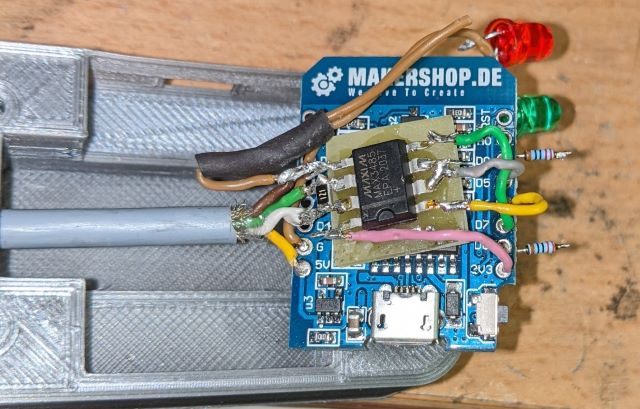
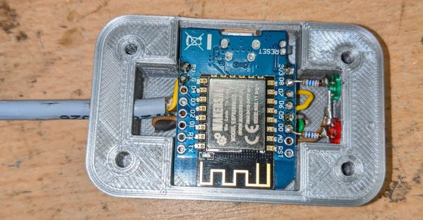

# SolisModbus-MQTT

## Introduction
Bridge between Solis/ Ginlong inverters and MQTT based on ESP8266. The inverter data is read from the RS-485 interface and send over WiFi to a connected MQTT broker.
Tested with Solis S6-GR1P1K-M

Based on code from jimmyburnworld (https://github.com/jimmyburnworld/SolisModbus-MQTT), October 2022. Changes: 

- Use correct Modbus registers of my inverter model. 
- Limited information export 
- Use JSON data in single MQTT topic
- Code cleanups

## Hardware

The ESP8266 is interfaced with the Solis inverter using RS-485 available on the inverters 'COM' port. COM port pinout is 1 = +5Vcc, 2 = 0V com, 3 = 'A' 4 = 'B'. Please note that this might vary by model and it is your responsibility to check before connecting. 

I used a MAX3485 to interface the ESP8266 to the RS-485 port. The MAX3485 is 3.3V compatible. MAX485 may work as well based on some sources in the internet but is 5V logic so your milage may vary.

MAX3485 connection

- Pin 1 RO - ESP8266 Pin D7
- Pin 2, 3, RE, DE  - ESP8266 Pin D5 
- Pin 4 DI - ESP8266 Pin D6
- Pin 5 GND - ESP8266 GND and Ginlong inverter Pin 2 
- Pin 6 A - Ginlong inverter Pin 3
- Pin 7 B - Ginlong inverter Pin 4
- Pin 8 Vcc - ESP8266 3.3V pin

The hardware is pretty basic. Note that:

- there is a 120Ohm resistor between A and B to terminate the RS-485 line 
- two status indicator LEDs in series to a 220 Ohm resistor are connected to the ESP8266 D8 and D0 pins
- I got the plug to connect to the inverter off ebay

STLs for the case can be found in the "case" folder in this repository.

## Software

Install via Arduino. Make sure to configure ESP8266 support and install the required libraries (ArduinoMqttClient, ArduionoJson, EspSoftwareSerial, ModbusMaster, ESP8266WiFi).
You need to configure:

- Wifi access credentials
- MQTT broker information and credentials

## Installation

Set inverter 'address' to 2 - check communications to BMS and Meter after doing this before proceeding
to connect ESP8266.

## Known issues:

Signed 16bit values and 32bit values do not work correctly.
The signed 16bit values are unsigned because the ModbusMaster library only returns uint16_t type.
32bit values are due to word/ byte swapping Endian-ness etc. I tried to fix this but don't have a good way of testing as none of the info makes use of more then 16bit
Only included the variables for this project, feel free to add more or remove
Search for RS485_MODBUS-Hybrid-BACoghlan-201811228-1854.pdf for protocol description and registers